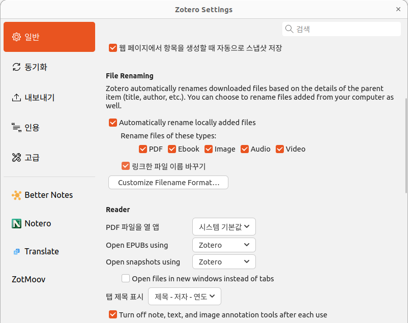
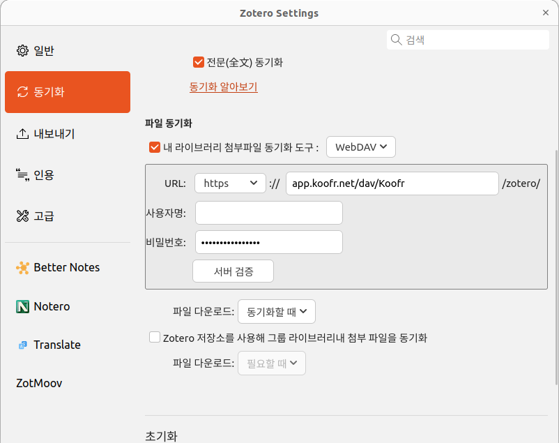

# Zotero 7 플러그인 모음

이 저장소는 **Zotero 7**에서 사용할 수 있는 플러그인들을 서브모듈로 관리합니다.

## 포함 플러그인
- **Better Notes**: 노트 기능 확장 - 2.5.1
- **Notero**: Notion 연동 - 1.1.0
- **zotero-pdf-translate**: PDF 번역 - 2.2.16
- **ZotMoov**: 라이브러리 간 항목 이동 - 1.2.21

## 설치 방법
1. 저장소 클론 및 서브모듈 포함:
   ```bash
   git clone --recursive https://github.com/your-username/my_zotero_plugin.git
   cd my_zotero_plugin
   ```
2. 각 플러그인 폴더에서 `.xpi` 파일을 Zotero에 설치

## File Renaming
- 파일 첨부시, renaming을 할 수 있음
- 아래 이미지 참고:



```text
{{ title truncate="100" suffix="-"  }}{{ firstCreator suffix="-"  }}{{ year}}
```


## File syn
- **WebDAV**를 통한 파일 동기화 지원
- 예시: `app.koofr.net/dav/Koofr` 경로 사용
- 아래 이미지 참고:



## 참고
- 각 플러그인은 독립적으로 설치/사용 가능
- Zotero 7.x 버전에서만 정상 동작
- 라이선스는 각 플러그인 폴더의 LICENSE 파일 참고
